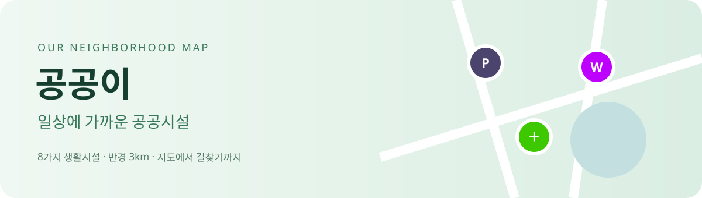
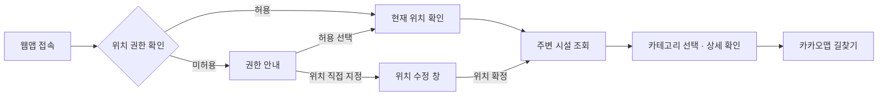

<div align="center">



**필요한 순간, 가까운 곳에서.**  
주차장부터 무료와이파이까지, 내 주변 생활시설을 한 지도에서 찾아보세요.


[서비스 소개](#서비스-소개) · [주요 기능](#주요-기능) · [실행 방법](#실행-방법) · [데이터 출처](#데이터-출처) · [기획서 수정본](docs/프로젝트1_기획서_수정본.md)

</div>

## 서비스 소개

**공공이**는 공공데이터와 카카오 지도를 활용한 반응형 생활시설 탐색 웹앱입니다. 현재 위치 또는 직접 지정한 위치를 기준으로 **반경 3km 내 시설을 거리순으로 최대 100곳** 보여줍니다.

> 시설 찾기 → 이용 정보 확인 → 카카오맵 길찾기.  
> 여러 사이트를 오가던 탐색 과정을 하나의 화면으로 연결합니다.

| 탐색 범위 | 시설 종류 | 상세 화면 | 길찾기 |
| :---: | :---: | :---: | :---: |
| 반경 **3km** | **7개** 카테고리 | PC 아코디언 · 모바일 바텀시트 | 카카오맵 도보 경로 |

## 주요 기능

### 01 · 내 위치에서 시작하기

- 위치 권한을 먼저 확인하고, 이미 허용됐다면 현재 위치를 가져옵니다.
- 미허용 상태에서는 시설 조회를 대기하고 안내의 **확인** 버튼으로 권한 요청을 시작합니다.
- 차단 상태에서는 브라우저 설정 변경 방법을 안내합니다.
- Permissions API 미지원 시 위치 조회의 성공·실패로 판단합니다.
- **위치 수정**에서 주소·장소 검색 또는 지도 드래그로 위치를 직접 지정할 수 있습니다. 위치 권한 없이도 이용 가능합니다.
- 지도만 움직여서는 거리 기준이 바뀌지 않습니다. 위치 수정 창에서 확정했을 때만 기준 위치를 변경합니다.

### 02 · 7가지 시설을 한눈에

| 카테고리 | 마커 색상 | 데이터 연결 |
| --- | --- | --- |
| 화장실 | 🔵 `#0074FF` | CSV |
| 무료와이파이 | 🟣 `#BE00FF` | CSV |
| 주차장 | `#4B446D` | 공공데이터포털 API |
| 휴지통 | ⚫ `#000000` | 공공데이터포털 API |
| 공원 | 🟢 `#3DC800` | 공공데이터포털 API |
| 금연구역 | 🔴 `#FF0000` | 공공데이터포털 API |
| 자전거보관소 | 🟠 `#FFBE00` | CSV |

전체 또는 개별 카테고리를 선택할 수 있습니다. 색상 핀 안의 흰색 원에 시설별 아이콘을 표시하고, 가까운 마커는 **같은 카테고리끼리** 묶어 개수를 보여줍니다. 겹치는 클러스터는 표시 위치를 벌리고, 클릭하면 실제 시설 위치를 중심으로 확대합니다.

### 03 · 선택부터 길찾기까지

- 시설 선택 시 핀이 부드럽게 커지며 선택 상태를 표시합니다.
- **PC(768px 초과)**: 해당 목록 항목에 상세 정보가 펼쳐집니다. 지도 핀을 눌러도 해당 항목으로 스크롤합니다.
- **모바일(768px 이하)**: 하단 바텀시트에 상세 정보를 표시합니다.
- 목록 선택과 **내 위치로 이동**은 카카오 지도 레벨 3으로 맞춥니다. 반복 클릭해도 계속 확대되지 않습니다.
- **카카오맵으로 길찾기**는 설정한 내 위치와 선택 시설을 출발지·도착지로 전달합니다. 앱 설치가 필요 없는 공식 웹 링크를 사용합니다.

### 04 · 주변 데이터만 필요한 만큼

CSV 전체를 브라우저가 내려받아 파싱하지 않습니다. 개발 서버 시작·빌드 단계에서 지역별 JSON을 생성하고, 브라우저에서는 주변 지역 파일만 요청합니다. API도 주변 지자체 코드로 범위를 제한합니다.

완료된 응답은 재사용하고, 위치가 변경되면 이전 요청을 취소합니다. 카테고리별 결과는 도착하는 순서대로 표시하며 일부 요청이 실패해도 다른 결과는 계속 이용할 수 있습니다.

## 이용 흐름



## 실행 방법

### 1. 의존성 설치

현재 프로젝트의 Vite 실행 조건을 충족하는 Node.js 환경에서 실행합니다.

```bash
npm install
```

### 2. 환경변수 설정

프로젝트 루트에 `.env.local`을 생성합니다. 실제 키는 저장소에 올리지 않습니다.

```dotenv
VITE_KAKAO_MAP_KEY=카카오_JavaScript_키
VITE_DATA_GO_KR_SERVICE_KEY=공공데이터포털_인증키
```

카카오 개발자 설정에는 실행할 웹 도메인을 등록하고, 공공데이터포털에서는 사용하는 API의 활용 신청 상태를 확인합니다.

> `VITE_` 환경변수는 클라이언트 번들에 포함됩니다. 현재 구조는 별도 백엔드 없이 브라우저에서 API를 호출하며, 환경변수 파일 사용이 인증키를 서버에 숨겨주는 것은 아닙니다.

### 3. 원본 데이터 준비

```text
data/
├── public_restroom_info.csv
├── free_Wi-Fi_info.csv
├── bicycle_parking_info.csv
└── icon/                     # 카테고리별 PNG 아이콘
```

CSV는 UTF-8 또는 EUC-KR로 읽습니다. 화장실 파일은 유효한 위도·경도가 포함된 가공본을 사용합니다. 좌표가 없는 시설은 지도 검색에서 제외됩니다.

### 4. 실행 및 빌드

```bash
npm run dev       # 개발 서버
npm run build     # dist 폴더에 배포 산출물 생성
npm run preview   # 빌드 결과 미리보기
```

시작·빌드 시 `data/nearby`를 자동 생성합니다. 원본이 바뀌지 않으면 기존 결과를 재사용하므로 CSV를 교체한 뒤에는 개발 서버를 재시작해주세요. `data/nearby`는 Git에 포함하지 않습니다.

## 프로젝트 구성

```text
002/
├── src/
│   ├── App.jsx                  # 지도·조회·선택 상태 통합
│   ├── HeaderIntro.jsx          # 메인 소개 영역
│   ├── LocationPicker.jsx       # 검색과 직접 위치 지정
│   ├── locationPermission.js    # 위치 권한 상태 처리
│   ├── FacilityListItem.jsx     # 목록과 PC 아코디언
│   ├── FacilityDetails.jsx      # 모바일 상세 바텀시트
│   ├── DirectionsButton.jsx     # 카카오맵 길찾기
│   ├── markerClusters.js        # 카테고리별 묶음과 겹침 처리
│   ├── nearbyData.js            # 지역 조회·캐시·취소 처리
│   ├── fileFacilities.js        # CSV 파싱과 시설 정규화
│   └── DataSourcesFooter.jsx    # 데이터 출처 표기
├── data/                        # 원본 CSV·아이콘
├── scripts/                     # 전처리와 기능 검증
├── docs/                        # README 이미지·기획서 수정본
└── vite.config.js               # Vite 설정·지역 데이터 생성
```

## 검증

```bash
npm run lint
node scripts/check-location-permission.mjs
node scripts/check-category-clusters.mjs
node scripts/check-map-navigation.mjs
node scripts/check-marker-selection.mjs
node scripts/check-accordion-scroll.mjs
node scripts/check-distance-origin.mjs
node scripts/check-place-search.mjs
node scripts/check-file-facilities.mjs
node scripts/check-nearby.mjs
```

위 명령은 재현 가능한 검증 방법입니다. 실제 브라우저의 권한창, 외부 지도 이동, 모바일 터치 및 화면 배치는 별도의 기기 점검이 필요합니다.

## 데이터 출처

| 구분 | 원본 자료 | 제공기관 |
| --- | --- | --- |
| 휴지통 | [전국휴지통표준데이터](https://www.data.go.kr/data/15129450/standard.do) | 지방자치단체 |
| 화장실 | [전국공중화장실표준데이터](https://www.data.go.kr/data/15012892/standard.do) | 행정안전부 · 지방자치단체 기초자료 등록 |
| 주차장 | [전국주차장정보표준데이터](https://www.data.go.kr/data/15012896/standard.do) | 지방자치단체 |
| 공원 | [전국도시공원정보표준데이터](https://www.data.go.kr/data/15012890/standard.do) | 지방자치단체 |
| 금연구역 | [전국금연구역표준데이터](https://www.data.go.kr/data/15013192/standard.do) | 지방자치단체 |
| 무료와이파이 | [전국무료와이파이표준데이터](https://www.data.go.kr/data/15013116/standard.do) | 행정안전부 · 지방자치단체 기초자료 등록 |
| 자전거보관소 | [전국자전거보관소표준데이터](https://www.data.go.kr/data/15017318/standard.do) | 행정안전부 · 지방자치단체 기초자료 등록 |
| 지도·검색 | [카카오 지도](https://apis.map.kakao.com/web/) · [카카오 로컬](https://developers.kakao.com/docs/ko/local/dev-guide) | 카카오 |

공공데이터는 공공누리 제1유형의 출처 표시 방식을 참고해 제공기관과 원문을 안내합니다. 원자료별 이용허락조건은 각 출처를 따릅니다. 카카오 지도·검색은 [이용약관](https://developers.kakao.com/terms/ko/site-terms)과 [운영정책](https://developers.kakao.com/terms/ko/site-policies)을 따릅니다.

## 현재 구현 범위와 한계

- 목록의 거리는 좌표 간 **직선거리**이며 실제 도보 이동거리와 다릅니다.
- 표시 결과는 반경 3km 내 최대 100곳입니다. 전국 모든 시설을 한 번에 표시하지 않습니다.
- API 조회 지역은 CSV에서 얻은 지자체 코드에 기반하므로 원본에 없는 기관의 자료는 누락될 수 있습니다.
- 시설의 수용량·운영정보는 원자료 기준입니다. 실시간 주차 잔여면수나 자전거 빈자리를 뜻하지 않습니다.
- 현재 사용자용 AI 요약·추천 기능과 서버리스 백엔드는 구현하지 않았습니다. 생성형 AI는 개발 보조에 활용했습니다.
- 배포 URL은 이 저장소에서 확인되지 않았습니다. 배포 완료 여부와 외부 접속은 별도 확인 대상입니다.

---

<div align="center">

**공공이 · 김수종**  
공공데이터 활용 웹앱 개발 프로젝트

<sub>본 서비스는 공공데이터 및 오픈 API를 활용한 비상업적 학습 목적의 2차 저작물입니다.</sub>

</div>
